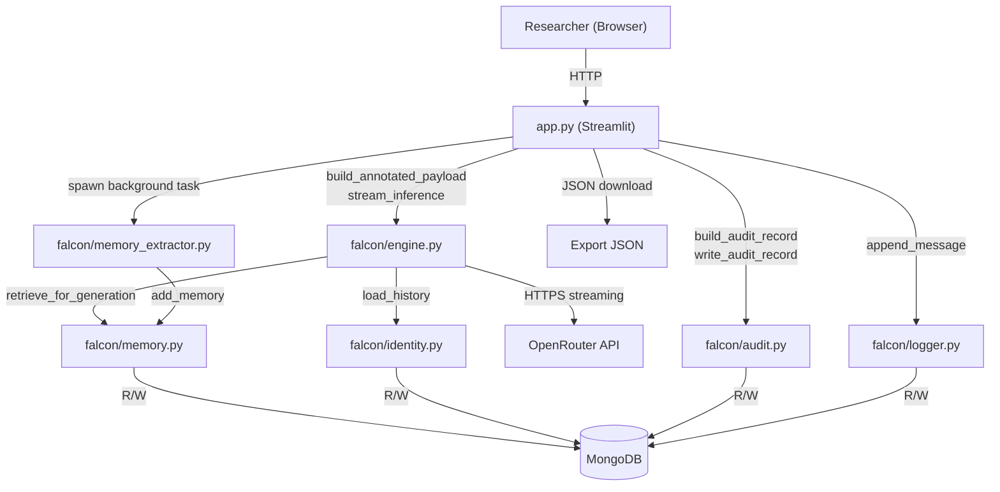
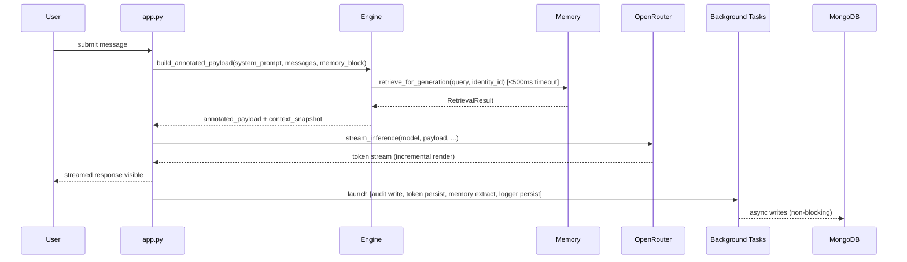

# Design Document — Falcon Transparent Inference

## Overview

Falcon is a **transparent context assembly and inference system**. It is not an AI assistant: it has no platform persona, no hidden defaults, and no opinionated conversational wrapper. Its job is to assemble a fully-annotated payload from discrete, inspectable sources — user input, identity-scoped conversation history, relevance-retrieved memory, and an optional user-authored system prompt — then stream that payload to a configurable model via OpenRouter.

The design is organised around seven non-negotiable principles drawn directly from the requirements:

1. **No default assistant fallback** — absent or empty system prompt → zero platform message injected.
2. **Always generate output** — `[no output]` marker emitted on blank model response; no silent failure.
3. **Full transparency** — every token entering generation is visible before and after via Source Annotation and the Context Viewer.
4. **Identity isolation** — no data from Identity A can appear in Identity B's payload, history, or memory.
5. **Model replaceability** — model is a runtime parameter; changing it touches nothing else.
6. **Inference audit trail** — every inference event produces a complete, reconstructable record.
7. **Portability** — all data exportable to self-contained JSON without a MongoDB dependency.

### Scope of this Design

This document covers the additions and changes required on top of the existing working core (`engine`, `memory`, `identity`, `logger`, `audit`, `config`, `db`, and the Streamlit `app`). The primary areas of work are:

- `build_annotated_payload` and payload source annotation (Req 3, 4, 20)
- Structured memory architecture with per-type scoring and `top_k_per_type` (Req 9, 20)
- `retrieve_for_generation` rewrite: weighted scoring, persona isolation, reasoning format (Req 9)
- `Memory_Extractor` background agent (Req 19, 22)
- Conversation history truncation strategies (Req 21)
- Non-blocking inference pipeline (Req 22)
- Config extension (Req 16, 21)
- Identity validation and isolation enforcement (Req 12)
- Audit record completeness (Req 14)
- Token counter persistence (Req 15)
- Export subsystem (Req 10)
- UI additions: system prompt sidebar, model selector, memory editing, context viewer, truncation controls (Req 1, 4, 8, 17, 18)

---

## Architecture

### System Context



### Request Lifecycle



The key design guarantee: the UI begins rendering tokens to the researcher as soon as the first chunk arrives. All post-generation side effects execute in background threads after the stream is exhausted. The main render loop never waits for them.

---

## Components and Interfaces

### 1. `falcon/engine.py` — Extended

#### `build_annotated_payload`

New public function. Returns a list of dicts with `role`, `content`, and `source` keys. Called by the UI before inference to produce both the raw payload (sent to the model) and the annotated view (rendered in the Context Viewer).

```python
VALID_SOURCES = frozenset({"system-prompt", "persona", "memory", "history", "user-input", "history-summary"})

def build_annotated_payload(
    system_prompt: str,
    messages: list[dict],       # full history including current user turn
    memory_block: list[dict],   # entries from RetrievalResult.entries
    truncation_strategy: str = "last-n-turns",
    history_max_turns: int = 20,
    history_token_budget: int = 4000,
    summary_message: dict | None = None,  # for summarize-and-compress
) -> tuple[list[dict], dict]:
    """
    Returns:
        annotated_payload: list of {role, content, source}
        context_snapshot:  dict with history_dropped_turns, retrieval_timeout, etc.
    """
```

**Ordering of elements in the assembled payload** (sent to the model):

1. Persona block `{"role":"system","content":...}` — if persona entry exists in memory_block
2. System prompt `{"role":"system","content":...}` — if non-empty/non-whitespace
3. History summary `{"role":"system","content":...}` — if summarize-and-compress strategy dropped turns
4. Memory block (non-persona entries formatted as a single system message)
5. Conversation history (truncated per strategy)
6. Current user input

**Source annotation mapping:**

| Element | `source` value |
|---------|---------------|
| Persona block | `"persona"` |
| System prompt | `"system-prompt"` |
| History summary | `"history-summary"` |
| Memory entries block | `"memory"` |
| History turn | `"history"` |
| Current user turn | `"user-input"` |

#### `build_payload` (existing — unchanged contract)

The existing `build_payload` remains for backward compatibility but the primary path for new code uses `build_annotated_payload`. The raw payload sent to the model is extracted from `build_annotated_payload` by dropping the `source` key from each element.

#### `stream_inference` (existing — minor extensions)

- `retrieve_for_generation` timeout enforcement: if the call to `Memory.retrieve_for_generation` inside `build_annotated_payload` exceeds 500 ms, abort it, log WARNING, set `retrieval_timeout=True` in snapshot, proceed with empty memory block.
- No synchronous MongoDB writes during the streaming phase.

#### History Truncation

The truncation logic lives inside `build_annotated_payload` and is controlled by `truncation_strategy`:

```
"last-n-turns"          → keep the most recent history_max_turns turn-pairs
"token-budget"          → keep newest turns fitting within history_token_budget tokens
"summarize-and-compress"→ keep most recent history_max_turns verbatim + prepend summary
```

Token estimation: character count divided by 4 (consistent with existing `context_token_estimate` in audit).

---

### 2. `falcon/memory.py` — Rewritten Retrieval

#### Updated `MemoryType`

```python
MemoryType = Literal["semantic", "episodic", "procedural", "working", "archive", "persona"]

_ACTIVE_TYPES   = ("semantic", "episodic", "procedural", "working")
_INACTIVE_TYPES = ("archive",)
_PERSONA_TYPE   = "persona"
_ALL_TYPES      = _ACTIVE_TYPES + _INACTIVE_TYPES + (_PERSONA_TYPE,)
```

`add_memory` updated to accept and validate `"persona"` and `"procedural"` in addition to existing types.

#### Updated `RetrievalResult`

```python
@dataclass
class RetrievalResult:
    entries:     list[dict]            # includes persona entry if present
    reasoning:   list[str]             # one string per non-persona entry
    by_type:     dict[str, list[dict]] # keyed by memory_type
    total_found: int
```

#### Updated `retrieve_for_generation`

```python
def retrieve_for_generation(
    identity_id: str,
    query: str = "",
    top_k_per_type: int = 3,
    recency_weight: float = 0.4,
    relevance_weight: float = 0.6,
) -> RetrievalResult:
```

**Scoring algorithm:**

```
For each active memory type (semantic, episodic, procedural, working):
  1. Fetch all non-archive entries for identity_id scoped to that type
  2. Sort by created_at descending → assign recency_rank_score = 1/(rank+1) normalised to [0,1]
  3. Compute overlap_score:
       - If entry is pinned → score = 1.0, match_reason = "pinned"
       - Elif any tag in entry.tags appears in query.lower() → tag overlap count / len(tags), reason = "tag-match"
       - Elif any word from entry.content.lower() in query.lower() → keyword match ratio, reason = "keyword-match"
       - Else → 0.0, reason = "recency"
  4. final_score = (recency_rank_score * recency_weight) + (overlap_score * relevance_weight)
  5. Sort by final_score descending, take top top_k_per_type
  6. Append to entries; reasoning line: "<type>/<id>: score=<score>, reason=<match_reason>"

Persona: if exists for identity_id, always prepended to entries; not scored; not counted in reasoning.
Archive: never returned from retrieve_for_generation.
```

**Identity isolation guarantee:** all queries carry `{"identity_id": identity_id}` filter; no cross-identity leakage possible.

---

### 3. `falcon/memory_extractor.py` — New Module

```python
"""
memory_extractor.py — Background memory extraction agent.

Runs in a background thread after each inference turn. Classifies content
from the completed turn into semantic/episodic/procedural/working types
and persists to MongoDB with source="auto".

NEVER touches persona or archive entries.
NEVER holds a reference to any mutable Engine state.
Receives only an immutable dict snapshot of the completed turn.
"""

def run(turn_snapshot: dict) -> None:
    """Entry point called in a background thread.

    turn_snapshot keys: identity_id, user_message, assistant_message,
                        turn_index, timestamp
    """
```

**Extraction strategy:** the extractor calls the configured LLM (via OpenRouter, same API key) with a minimal extraction prompt requesting JSON output classifying facts from the turn. Entries are validated before persistence. If the LLM call fails or the JSON is malformed, the extractor logs at ERROR and exits silently.

**Queue management:** `_handle_send` maintains a per-identity deque of pending extraction tasks. If queue depth ≥ 10 for an identity, the new task is dropped and a WARNING is logged.

```python
_extractor_queues: dict[str, deque] = defaultdict(lambda: deque(maxlen=10))
```

---

### 4. `falcon/identity.py` — Extended

`forbidden_chars = frozenset({"/", "\\", "..", "\x00"})`

`_validate_identity_id` already exists; it raises `ValueError` for any identity_id containing a character in `forbidden_chars`. This remains the enforcement point.

---

### 5. `falcon/config.py` — Extended

New settings exposed (all loaded from `config.yaml` with fail-fast validation):

```python
# Memory retrieval
top_k_per_type: int        # default 3, range [1, 20]
recency_weight: float      # default 0.4
relevance_weight: float    # default 0.6

# History truncation
history_truncation_strategy: str  # "last-n-turns" | "token-budget" | "summarize-and-compress"
history_max_turns: int            # default 20, range [1, 100]
history_token_budget: int         # default 4000, range [100, 200000]

# Memory extraction
memory_extraction_enabled: bool   # default True

# Assistant language detection
assistant_language_patterns: list[str]  # default list per Req 16.5
```

Validation rules:
- `history_truncation_strategy` not in valid set → `ValueError` at import
- `history_max_turns` outside [1, 100] → `ValueError`
- `history_token_budget` outside [100, 200000] → `ValueError`
- `top_k_per_type` outside [1, 20] → `ValueError`

---

### 6. `falcon/audit.py` — Extended

`build_audit_record` updated to include all required fields (Req 14.1):

```python
def build_audit_record(
    identity_id: str,
    model: str,
    prompt_state: str,           # "present" | "empty"
    system_prompt: str,
    retrieved_memories: list,
    generation_settings: dict,
    context_size: int,
    context_token_estimate: int,
    assembled_payload: list,
    raw_model_output: str,
    usage: dict,
    latency_ms: float,
) -> dict:
```

All fields are mandatory. Missing fields cause `ValueError`. `read_audit_records` filters by `identity_id`, returns newest-first (existing behaviour confirmed).

---

### 7. `app.py` — UI Layer Changes

#### Sidebar additions

- **System prompt toggle** (ON/OFF) + text area + "Reset to default" button (Req 1)
- **Model selector** dropdown from `config.available_models` (Req 8)
- **Truncation strategy** dropdown + associated limit input (Req 21)
- Token counter display (Req 15)

#### Chat tab

- Per-message "⌥ context" button opens payload dialog (existing `_show_payload_dialog`)
- Assistant-language warning banner when system-prompt is OFF and output contains pattern from `assistant_language_patterns`

#### Context tab

- `_render_context_view` extended to colour-code elements by `source` value
- Persona block labelled distinctly; dropped history shown as `▸ [N turns truncated]` placeholder
- "Export context snapshot" button (Req 10.4)

#### Memory tab (Req 18)

- Sections: Persona, Semantic, Episodic, Procedural, Working, Archive
- Each section: inline Edit (content + tags), Save/Cancel, Delete (with confirmation modal), "Clear type" (with confirmation), "Add entry" form
- Persona section: individual fields (`name`, `tone`, `communication_style`, `core_traits`)
- "Test retrieval" input + button
- Disabled-extraction notice banner when `memory_extraction_enabled=False`
- "Export memory" button

#### Audit tab

- "Export audit log" button (Req 10.3)

#### Logs tab

- "Export conversation" button (Req 10.1)

---

## Data Models

### Memory Document (MongoDB `memory` collection)

```python
{
    "_id":              ObjectId,
    "identity_id":      str,           # owner identity
    "memory_type":      str,           # one of _ALL_TYPES
    "content":          str,           # max 10,000 chars
    "tags":             list[str],
    "created_at":       str,           # ISO 8601 UTC
    "updated_at":       str,           # ISO 8601 UTC
    "pinned":           bool,
    "source":           str,           # "user" | "auto" | "manual" | "import"
    # Non-persona entries only:
    "score":            float,         # 0.0–1.0, populated at retrieval time (not stored)
    "match_reason":     str,           # "pinned" | "tag-match" | "keyword-match" | "recency"
}
```

Persona document additionally carries:
```python
{
    "memory_type": "persona",
    "name":               str,
    "tone":               str,
    "communication_style": str,
    "core_traits":        str,
    "content":            str,   # serialised summary for payload injection
}
```

### Annotated Payload Element

```python
{
    "role":    str,   # "system" | "user" | "assistant"
    "content": str,
    "source":  str,   # one of VALID_SOURCES
}
```

### Context Snapshot

```python
{
    "system_prompt":        str | None,
    "prompt_state":         str,           # "present" | "empty"
    "persona_block":        dict | None,   # annotated element
    "memory_entries":       list[dict],    # annotated elements
    "history_included":     list[dict],    # annotated elements (truncated view)
    "history_dropped_turns": int,
    "truncation_strategy":  str,
    "current_input":        dict,          # annotated element
    "assembled_payload":    list[dict],    # raw {role, content} for model
    "annotated_payload":    list[dict],    # {role, content, source}
    "context_token_estimate": int,
    "retrieval_timeout":    bool,
    "retrieval_result":     dict,          # RetrievalResult.to_display_dict()
    "message_count":        int,
}
```

### Audit Record

```python
{
    "timestamp":             str,    # ISO 8601
    "identity_id":           str,
    "model":                 str,
    "prompt_state":          str,
    "system_prompt":         str,
    "retrieved_memories":    list,
    "generation_settings":   dict,
    "context_size":          int,
    "context_token_estimate": int,
    "assembled_payload":     list,
    "raw_model_output":      str,
    "usage":                 dict,   # prompt_tokens, completion_tokens, total_tokens
    "latency_ms":            float,
}
```

### Token Persistence Document (MongoDB `tokens` collection)

```python
{
    "identity_id": str,
    "prompt":      int,
    "completion":  int,
    "total":       int,
    "updated_at":  str,
}
```

### Export JSON Envelope

```python
{
    "falcon_export_version": "1",
    "exported_at":           str,   # ISO 8601
    "identity_id":           str,
    "data":                  list | dict,   # conversation | memory | audit | context
}
```

All MongoDB `ObjectId` fields serialised as `str`.

---

## Correctness Properties

*A property is a characteristic or behavior that should hold true across all valid executions of a system — essentially, a formal statement about what the system should do. Properties serve as the bridge between human-readable specifications and machine-verifiable correctness guarantees.*

The following properties are implemented using [Hypothesis](https://hypothesis.readthedocs.io/) (Python PBT library), with a minimum of 100 iterations per property.

---

### Property 1: Empty system prompt produces no system message

*For any* `system_prompt` value that is `None`, the empty string, or composed entirely of whitespace characters, `build_annotated_payload` SHALL return a list containing no element with `role == "system"` and `source == "system-prompt"`.

**Validates: Requirements 1.1**

---

### Property 2: Non-empty system prompt is byte-for-byte first system element

*For any* non-empty, non-whitespace-only `system_prompt` string, `build_annotated_payload` SHALL return a list whose first element (after any persona block) has `role == "system"`, `source == "system-prompt"`, and `content` equal byte-for-byte to the supplied string.

**Validates: Requirements 1.2**

---

### Property 3: Empty model output yields `[no output]` marker

*For any* model response string that is empty or composed entirely of whitespace, `stream_inference` SHALL set `raw_output` to `"[no output]"` and SHALL have yielded `"[no output]"` as the sole token.

**Validates: Requirements 2.1, 2.2**

---

### Property 4: Annotated payload structural completeness

*For any* combination of `system_prompt`, `messages` list, and `memory_block`, every element returned by `build_annotated_payload` SHALL contain exactly the keys `"role"`, `"content"`, and `"source"`, and the value of `"source"` SHALL be a member of `VALID_SOURCES`.

**Validates: Requirements 3.1, 3.2**

---

### Property 5: Source annotation correctness

*For any* assembled annotated payload, each element's `source` value SHALL correctly reflect its semantic origin: persona entries → `"persona"`, system prompt → `"system-prompt"`, memory entries → `"memory"`, history turns → `"history"`, current user turn → `"user-input"`, and history summaries → `"history-summary"`. No element shall carry a `source` value inconsistent with its position and input origin.

**Validates: Requirements 3.3, 3.4, 3.5, 3.6, 20.5**

---

### Property 6: Invalid memory type raises `ValueError`

*For any* string value of `memory_type` not in `{"semantic", "episodic", "procedural", "working", "archive", "persona"}`, calling `Memory_Module.add_memory` SHALL raise `ValueError` and SHALL NOT persist any document to MongoDB.

**Validates: Requirements 9.1**

---

### Property 7: Retrieval never crosses identity boundary

*For any* `identity_id == id_A` and any state of the memory store, `retrieve_for_generation(identity_id=id_A)` SHALL return a `RetrievalResult` whose `entries` list contains no element with `identity_id` field differing from `id_A`.

**Validates: Requirements 9.8, 12.2**

---

### Property 8: `top_k_per_type` limit is enforced per type

*For any* memory store containing more than `top_k_per_type` entries of a single active type for a given identity, `retrieve_for_generation` SHALL return at most `top_k_per_type` entries of that type in `RetrievalResult.entries` (excluding persona entries, which are uncapped).

**Validates: Requirements 9.4**

---

### Property 9: Persona always included, never scored, absent when missing

*For any* identity with an existing persona entry, `retrieve_for_generation` SHALL include that entry in `RetrievalResult.entries` regardless of `query` or `top_k_per_type`; and *for any* identity with no persona entry, `retrieve_for_generation` SHALL return a `RetrievalResult` with no element having `memory_type == "persona"` (not even `null`).

**Validates: Requirements 9.5, 20.3, 20.4**

---

### Property 10: Reasoning cardinality matches non-persona entries

*For any* `RetrievalResult` returned by `retrieve_for_generation`, `len(RetrievalResult.reasoning)` SHALL equal the count of entries in `RetrievalResult.entries` that have `memory_type != "persona"`.

**Validates: Requirements 9.7**

---

### Property 11: Non-persona entries carry valid score and match_reason

*For any* non-persona entry in `RetrievalResult.entries`, the entry SHALL have a `score` field of type `float` in the range `[0.0, 1.0]` and a `match_reason` field whose value is exactly one of `{"pinned", "tag-match", "keyword-match", "recency"}`.

**Validates: Requirements 9.6**

---

### Property 12: `clear_working_memory` is identity-scoped

*For any* two distinct identities `id_A` and `id_B` both having working memory entries, calling `Memory_Module.clear_working_memory(id_A)` SHALL result in zero remaining working entries for `id_A` and SHALL leave all working entries for `id_B` unchanged.

**Validates: Requirements 12.3, 9.2**

---

### Property 13: `load_history` is identity-scoped

*For any* identity `id_A`, `Identity_Manager.load_history(id_A)` SHALL return only messages whose `identity_id` field equals `id_A`. No message from any other identity SHALL appear in the result.

**Validates: Requirements 12.1**

---

### Property 14: Forbidden character in `identity_id` raises `ValueError`

*For any* string containing at least one character from `forbidden_chars = {"/", "\\", "..", "\x00"}`, calling `Identity_Manager.load_history` with that string as `identity_id` SHALL raise `ValueError`.

**Validates: Requirements 12.6**

---

### Property 15: Audit record contains all required fields

*For any* valid set of inputs to `Audit_Module.build_audit_record`, the returned dict SHALL contain all of the following keys: `timestamp`, `identity_id`, `model`, `prompt_state`, `system_prompt`, `retrieved_memories`, `generation_settings`, `context_size`, `context_token_estimate`, `assembled_payload`, `raw_model_output`, `usage`, `latency_ms`. No key SHALL be absent regardless of input combination.

**Validates: Requirements 14.1**

---

### Property 16: Memory extractor never writes persona or archive entries

*For any* conversation turn processed by `Memory_Extractor.run`, no entry persisted to MongoDB SHALL have `memory_type == "persona"` or `memory_type == "archive"`. All persisted entries SHALL have `source == "auto"` and `identity_id` exactly matching the turn's `identity_id`.

**Validates: Requirements 19.3, 19.4, 19.5**

---

### Property 17: `last-n-turns` truncation includes exactly the right number of turn-pairs

*For any* conversation history and any `history_max_turns` value in `[1, 100]`, when `history_truncation_strategy == "last-n-turns"`, the assembled payload SHALL contain at most `history_max_turns` history turn-pairs (user + assistant), and `history_dropped_turns` SHALL equal `max(0, total_pairs - history_max_turns)`.

**Validates: Requirements 21.4, 21.7**

---

### Property 18: `token-budget` truncation keeps total history tokens within budget

*For any* conversation history, `history_token_budget` value in `[100, 200000]`, and token estimation function, when `history_truncation_strategy == "token-budget"`, the total estimated token count of the included history elements SHALL not exceed `history_token_budget` (except when a single turn-pair alone exceeds the budget, in which case that pair is included alone).

**Validates: Requirements 21.5**

---

### Property 19: Export JSON is a valid round-trip serialization

*For any* set of Falcon data (conversation history, memory entries, audit records), the exported JSON file SHALL be parseable by a standard JSON parser, SHALL contain a `falcon_export_version` field equal to `"1"`, and SHALL contain no `ObjectId` values — all document IDs SHALL be serialised as strings.

**Validates: Requirements 10.5, 10.6, 10.7**

---

## Error Handling

### Engine layer

| Condition | Behaviour |
|-----------|-----------|
| `retrieve_for_generation` exceeds 500 ms | Abort, proceed with empty memory block, log WARNING, set `retrieval_timeout=True` in snapshot |
| Model API connection failure | Propagate exception to UI; UI displays error banner |
| Model returns empty/whitespace response | Yield `[no output]` marker; set `raw_output = "[no output]"` |
| `build_annotated_payload` receives invalid `truncation_strategy` | Raise `ValueError` immediately |

### Memory layer

| Condition | Behaviour |
|-----------|-----------|
| Invalid `memory_type` | `ValueError` — not persisted |
| `ObjectId` not found on update/delete | Return `False`; caller decides |
| MongoDB connection failure | Propagate `pymongo` exception to caller |

### Memory Extractor

| Condition | Behaviour |
|-----------|-----------|
| LLM extraction call fails | Catch, log ERROR with `identity_id` and turn index, exit silently |
| Malformed JSON from LLM | Catch `json.JSONDecodeError`, log ERROR, persist zero entries |
| MongoDB write fails | Catch, log ERROR, do not re-raise |
| Exception propagates to thread | Catch at thread boundary, log ERROR, do not crash main thread |
| Queue at capacity (≥10 for identity) | Drop task, log WARNING with `identity_id` and turn index |

### Config layer

| Condition | Behaviour |
|-----------|-----------|
| `OPENROUTER_API_KEY` absent/empty | `ValueError` at import |
| `MONGODB_URI` absent/empty | `ValueError` at import |
| `config.yaml` not found | `ValueError` at import |
| `default_model` missing/empty | `ValueError` at import |
| `history_truncation_strategy` invalid | `ValueError` at import |
| `history_max_turns` outside `[1,100]` | `ValueError` at import |
| `history_token_budget` outside `[100,200000]` | `ValueError` at import |
| `top_k_per_type` outside `[1,20]` | `ValueError` at import |

### Audit layer

| Condition | Behaviour |
|-----------|-----------|
| `write_audit_record` raises | UI suppresses error, logs it, continues chat flow |

### UI layer

| Condition | Behaviour |
|-----------|-----------|
| Memory write fails | Display inline error, retain edit form |
| Memory delete fails | Display inline error, do not remove entry from list |
| Token persist fails | Log ERROR, do not disrupt UI |
| Export serialisation fails | Display error banner |
| Model not in `available_models` | Display error, do not initiate inference |
| Background task exception | Caught in thread, logged at ERROR, not surfaced to chat |

---

## Testing Strategy

### Dual-layer approach

All features are covered by both unit/example-based tests and property-based tests (where applicable). Neither replaces the other: unit tests catch concrete bugs and verify specific scenarios; property tests verify universal invariants across the full input space.

### Property-Based Testing with Hypothesis

Hypothesis is already present in the project (`.hypothesis/` directory exists). Each correctness property above is implemented as a single `@given`-decorated test function with `settings(max_examples=100)`.

**Tag format for traceability:**

```python
# Feature: falcon-transparent-inference, Property 1: Empty system prompt produces no system message
@given(system_prompt=st.one_of(st.none(), st.just(""), st.text(alphabet=" \t\n\r")))
@settings(max_examples=100)
def test_empty_system_prompt_no_system_message(system_prompt):
    ...
```

**Pure-function properties** (Properties 1–5, 17–18): use the engine functions directly with no mocking required. Fast, deterministic, no I/O.

**Memory properties** (Properties 6–12): use a MongoDB in-memory mock (e.g., `mongomock`) or a real test database with teardown fixtures. Generators produce `identity_id` strings, memory type strings, and entry content.

**Identity properties** (Properties 13–14): mock MongoDB reads; test `_validate_identity_id` and `load_history` filtering logic.

**Audit property** (Property 15): generate random dicts for all fields; verify key completeness.

**Extractor property** (Property 16): mock the LLM call to return controlled JSON; inspect MongoDB insertions.

**Export property** (Property 19): generate random data sets; call export function; parse result with `json.loads`; assert structure.

### Unit / Example-based Tests

Unit tests cover:
- UI state: toggle ON/OFF → correct `system_prompt` value passed to engine
- Model change → only `selected_model` updated in session state
- `_handle_send` complete flow with mocked engine (success + empty response)
- Audit record written after successful inference
- Token counters loaded on identity init; updated after inference
- Memory editing: edit, save, cancel, delete (with confirmation), clear type
- Export file naming, `falcon_export_version` field presence
- Config validation: each bad config value produces the correct `ValueError` message
- `summarize-and-compress` strategy: fallback on summary failure
- Context Viewer: dropped-turn placeholder rendering
- Non-blocking: `_handle_send` returns before background tasks complete (use threading event)

### Integration Tests

Small number of integration tests against a real (test-database-isolated) MongoDB instance:
- Full `_handle_send` flow: message logged, audit written, tokens updated
- `Memory_Extractor.run` persists entries with correct `identity_id` and `source`
- Identity switch: no state bleed between identities

### Performance Checks

- `retrieve_for_generation` completes within 500 ms for a collection of up to 1000 entries (smoke test)
- Background tasks dispatched within 100 ms of stream exhaustion (timing assertion with mocked tasks)
