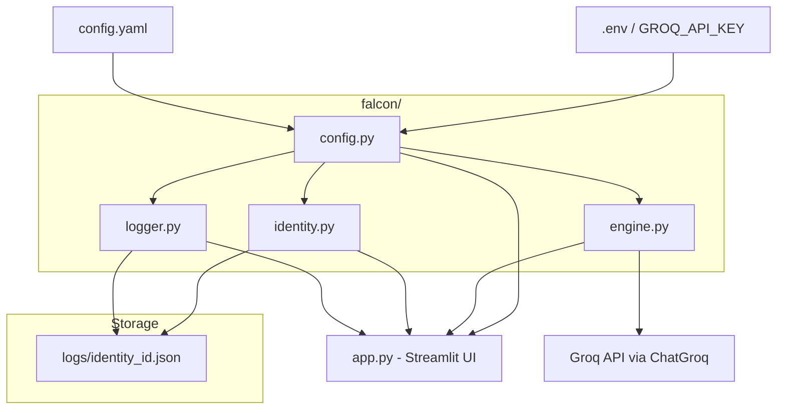
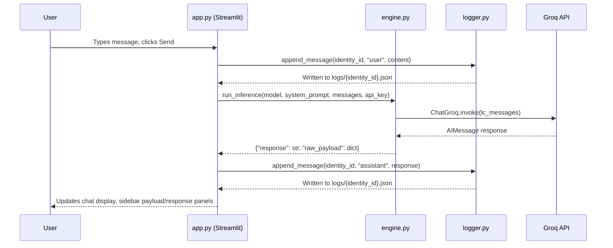
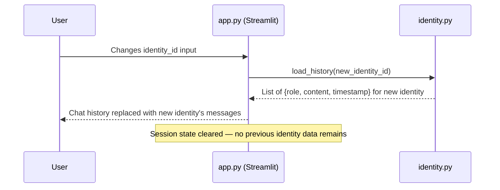
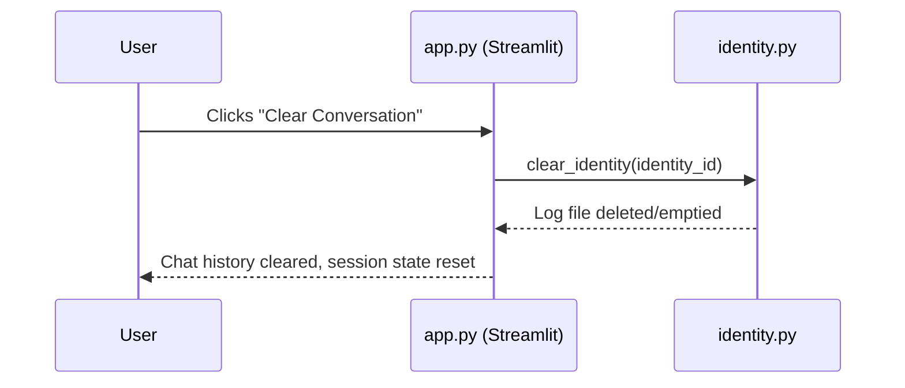

# Design Document: Falcon V1

## Overview

Falcon V1 is a neutral LLM communication interface — infrastructure, not an assistant. It provides a clean, transparent channel between a user and a language model: input goes in, output comes out, and every layer of the interaction is visible. There is no personality, no hidden prompt injection, no framing. The system's primary design values are **context continuity** and **neutrality**.

**Context continuity** means an identity's complete conversation history is sent with every inference call. The model always has the full accumulated context of that identity — across messages, across sessions, across app restarts. There is no summarization, no truncation by the app, no context window management. If the Groq API rejects a call due to token limits, that is surfaced as an error; the app never silently drops history.

**Neutrality** means the system actively suppresses default assistant behavior at every layer. No hidden system prompts, no helpfulness framing, no coaching injected anywhere in the codebase. What the user types in the system prompt box is the complete and only instruction given to the model. If it's empty, no system message is sent. The UI provides functional labels only — it does not guide, suggest, or coach.

The implementation uses Streamlit for the UI, LangChain + Groq as the inference layer, and local JSON files for per-identity logging. The design is intentionally minimal: no database, no agents, no RAG, no streaming. V1 establishes the clean foundation that future versions (local hardware, different backends) can build on by changing a single config line.

The architecture is a five-component flat stack — Config → Engine → Logger/Identity → App — with no circular dependencies and no shared mutable state between identities.

## Architecture



All external state lives in `logs/`. All secrets live in `.env`. `config.py` is the single source of truth for runtime configuration. `app.py` is the only consumer of all falcon modules — no module imports another.

## Sequence Diagrams

### Send Message Flow



### Identity Switch Flow



### Clear Conversation Flow



## Components and Interfaces

### Component 1: config.py — Configuration Loader

**Purpose**: Single point of entry for all runtime configuration. Loads environment variables and YAML config, validates required values, and exposes them to all other modules.

**Interface**:
```
GROQ_API_KEY: str          # Loaded from .env — raises ValueError if missing
available_models: list     # From config.yaml available_models list
default_model: str         # From config.yaml default_model
default_system_prompt: str # From config.yaml — always empty string in V1
log_dir: str               # From config.yaml — "logs"
```

**Responsibilities**:
- Load `.env` via `python-dotenv`
- Load `config.yaml` via `PyYAML`
- Raise a clear, human-readable `ValueError` (not a traceback) if `GROQ_API_KEY` is absent
- Expose a flat namespace of configuration values — no nested config objects

---

### Component 2: engine.py — Inference Engine

**Purpose**: Thin wrapper around `ChatGroq`. Accepts a complete conversation state, constructs the exact payload sent to the model, calls the API, and returns the response alongside the raw payload for UI transparency. The engine's job is to pass everything through exactly as given — nothing added, nothing removed.

**Interface**:
```
build_payload(system_prompt: str, messages: list[dict]) -> list[dict]
    # Returns the exact list of {role, content} dicts sent to the model
    # system_prompt included only if non-empty string (not whitespace-only)
    # messages is the complete history — the engine does not slice or truncate it

run_inference(model_name: str, system_prompt: str, messages: list[dict], groq_api_key: str) -> dict
    # Returns: {"response": str, "raw_payload": list[dict]}
    # raw_payload is the exact message list sent to the API — full history included
```

**Responsibilities**:
- Convert `{role, content}` dicts to LangChain message objects (`SystemMessage`, `HumanMessage`, `AIMessage`)
- Instantiate `ChatGroq` with the given model and API key — no caching, no reuse
- Call `llm.invoke()` — no chains, no agents, no tools
- Return response text and the exact outbound payload as a Python dict (for `st.json()` display)
- Pass `system_prompt` to the model only if it is a non-empty, non-whitespace-only string
- Pass the full `messages` list to the API without truncation — every prior turn is included
- Add no content of any kind beyond what the caller provides: no preamble, no framing, no injected assistant persona

---

### Component 3: identity.py — Identity Isolation

**Purpose**: Manages per-identity log file access. Provides the lookup, loading, and clearing of identity-scoped conversation histories. Guarantees zero cross-contamination between identities.

**Interface**:
```
list_identities() -> list[str]
    # Returns all identity_ids that have log files in logs/
    # Derived from filenames: logs/identity_id.json → "identity_id"

load_history(identity_id: str) -> list[dict]
    # Returns list of {role, content, timestamp} in chronological order
    # Returns [] if no log file exists for this identity

clear_identity(identity_id: str) -> None
    # Deletes or empties the log file for identity_id
    # No-op if file does not exist
```

**Responsibilities**:
- All file paths derived from `identity_id` — never accept a raw path
- Never read from more than one identity's file per call
- `load_history` returns a copy, not a live reference
- `clear_identity` is irreversible — the app confirms before calling

---

### Component 4: logger.py — Append-Only JSON Logger

**Purpose**: Writes conversation messages to disk in human-readable JSON immediately as they occur. Never buffers, never overwrites existing entries.

**Interface**:
```
append_message(identity_id: str, role: str, content: str) -> None
    # Appends one message entry to logs/{identity_id}.json
    # Creates the file and logs/ directory if they don't exist
    # Writes immediately — no buffering
```

**Responsibilities**:
- Auto-create `logs/` directory on first write
- Read existing log file (or start with empty list), append new entry, write full file back
- Timestamp format: ISO 8601 UTC (`2025-06-05T14:22:01Z`)
- Log entries contain exactly three fields: `timestamp`, `role`, `content` — nothing else
- File must remain valid JSON after every write (not line-delimited JSON)

---

### Component 5: app.py — Streamlit UI

**Purpose**: Assembles all components into a functional interface. Manages Streamlit session state, renders the chat and transparency panels, and wires user actions to the appropriate module calls. The UI provides functional labels only — it does not coach, suggest, or guide the user in any way.

**Interface**: Streamlit application (no programmatic API — entry point only).

**Responsibilities**:
- Initialize session state on first load: identity_id, history, system_prompt, model, last_payload, last_response
- Render main area: identity selector, chat history, message input, Edit Logs button, Clear Conversation button
- Render sidebar: model selector, system prompt editor, raw payload panel, raw response panel, identity info
- On identity change: call `load_history()` and replace session state history immediately — full history, no truncation
- On Send: load full history → log user message → call engine with full history → log assistant response → update session state → re-render
- On Clear: call `clear_identity()` → reset session state history → re-render
- The Edit Logs button displays the file path and instructs the user to edit manually, then reload
- **Context continuity**: on every Send, the `messages` argument passed to `Engine.run_inference()` is the complete loaded history including the just-logged user message — all prior turns, in order, without omission
- **No coaching**: the system prompt field has no placeholder text; UI labels are functional only (e.g., "System Prompt", "Send") — no guidance, suggestions, or examples anywhere in the interface
- **App restart continuity**: when the app starts, it loads the log file for the default identity and populates session history from disk — the user continues exactly where they left off

## Data Models

### JSON Log Entry

Each entry in `logs/{identity_id}.json`:

```json
{
  "timestamp": "2025-06-05T14:22:01Z",
  "role": "user",
  "content": "Hello."
}
```

**Field rules**:
- `timestamp` — ISO 8601 UTC string, set at write time
- `role` — exactly `"user"` or `"assistant"` — no other values
- `content` — raw string, exactly as received from user or model — no modification

**File format**: A single top-level JSON array. Valid JSON after every append. Human-editable in any text editor.

```json
[
  {
    "timestamp": "2025-06-05T14:22:01Z",
    "role": "user",
    "content": "Hello."
  },
  {
    "timestamp": "2025-06-05T14:22:03Z",
    "role": "assistant",
    "content": "Hello."
  }
]
```

**Validation rules**:
- No entry may have a role other than `"user"` or `"assistant"`
- `content` must be a non-null string (may be empty)
- `timestamp` must be present on every entry

---

### Engine Payload (outbound to Groq)

The raw payload returned by `build_payload()` and displayed in the sidebar:

```json
[
  {
    "role": "system",
    "content": "You are a pirate."
  },
  {
    "role": "user",
    "content": "What is 2+2?"
  },
  {
    "role": "assistant",
    "content": "Four, arrr."
  },
  {
    "role": "user",
    "content": "Are you sure?"
  }
]
```

**Rules**:
- The `system` entry is included only when `system_prompt` is non-empty
- All prior conversation turns from the loaded identity history are included (full context window)
- Entries are in strict chronological order
- No additional fields — role and content only

---

### Streamlit Session State

Key session state fields managed by `app.py`:

| Key | Type | Description |
|-----|------|-------------|
| `identity_id` | `str` | Current identity. Default: `"default"` |
| `history` | `list[dict]` | In-memory copy of loaded log: `{role, content, timestamp}` |
| `system_prompt` | `str` | Current system prompt text. Default: `""` |
| `selected_model` | `str` | Currently selected model name |
| `last_payload` | `list[dict]` or `None` | Raw payload from the last send, for sidebar display |
| `last_response` | `str` or `None` | Raw response text from the last send, for sidebar display |

---

### config.yaml Structure

```yaml
default_model: "llama3-70b-8192"

available_models:
  - "llama3-70b-8192"
  - "llama3-8b-8192"
  - "mixtral-8x7b-32768"
  - "gemma2-9b-it"

default_system_prompt: ""

log_dir: "logs"
```

**Rules**:
- `default_system_prompt` must remain empty string — never pre-filled
- `available_models` is the only place to add or remove models — no code changes required
- `log_dir` path is relative to the project root

## Correctness Properties

These properties define the behavioral invariants that must hold across all states of the system. They are verifiable through property-based tests and integration tests.

### Property 1: Identity Isolation

**Validates: Requirements 1.1, 1.2, 1.3, 1.4, 1.5**

For any two distinct identity IDs `A` and `B`, no operation on identity `A` may affect the data returned for identity `B`.

- `append_message(A, ...)` followed by `load_history(B)` returns the same result as `load_history(B)` alone
- `clear_identity(A)` does not alter the log file at `logs/B.json`
- `list_identities()` returns a set — each identity appears exactly once regardless of how many messages it has

### Property 2: Payload Transparency

**Validates: Requirements 2.1, 2.2, 2.3, 2.4, 2.5**

The `raw_payload` returned by `run_inference()` must exactly match the message list sent to the model. No hidden messages, no injected context, no reordering.

- If `system_prompt` is non-empty: `raw_payload[0] == {"role": "system", "content": system_prompt}`
- If `system_prompt` is empty or `None`: no `{"role": "system", ...}` entry appears anywhere in `raw_payload`
- All user and assistant messages appear in `raw_payload` in the same order they were passed in
- `len(raw_payload) == len(messages) + (1 if system_prompt else 0)`

### Property 3: Log Integrity

**Validates: Requirements 3.1, 3.2, 3.3, 3.4, 3.5, 3.6**

The log file for any identity must be valid JSON after every write operation, and entries must be append-only.

- After every call to `append_message(identity_id, ...)`, `logs/{identity_id}.json` parses as valid JSON
- The number of entries in the log only ever increases (within a session without `clear_identity`)
- `load_history(identity_id)` after `N` calls to `append_message` returns exactly `N` entries in insertion order
- No existing entry's `timestamp`, `role`, or `content` is mutated by a subsequent `append_message` call

### Property 4: Neutrality

**Validates: Requirements 4.1, 4.2, 4.3, 4.4, 4.7, 4.8, 4.9**

The system must not inject any content into the conversation beyond what the caller explicitly provides, at any layer.

- If `system_prompt == ""` or is whitespace-only, the LangChain message list passed to `ChatGroq.invoke()` contains no `SystemMessage`
- The `content` field of every `HumanMessage` and `AIMessage` in the payload equals the corresponding input string with no modification, prefix, suffix, or whitespace normalization
- `build_payload("", messages)` returns a list with `len(messages)` entries and no entry with `role == "system"`
- No string literal in the codebase injects assistant framing, helpfulness instructions, coaching language, or personality descriptors into any message sent to the model

### Property 5: Config Completeness

**Validates: Requirements 5.1, 5.2, 5.3**

The system must fail loudly and immediately on startup when required configuration is absent, rather than failing silently at inference time.

- If `GROQ_API_KEY` is absent from the environment, `config.py` raises a `ValueError` before any other module is used
- The raised error message is human-readable and actionable (not a raw traceback)
- Required config values (`default_model`, `log_dir`) are present and non-empty after a successful load; `default_system_prompt` is present and is an empty string

### Property 6: Context Continuity

**Validates: Requirements 1.9, 1.10, 1.11**

Every inference call for an identity receives the identity's complete conversation history. No prior turn is ever omitted, truncated, or reordered by the application layer.

- For an identity with `N` prior messages logged, `run_inference()` receives a `messages` list of length `N` (plus the current user message, totalling `N+1`) — the app never slices the history
- After an app restart, `load_history(identity_id)` returns the same entries that were present before the restart; the app resumes with the full prior context on the next send
- The app never applies any summarization, compression, sliding window, or other history-reduction strategy to the messages passed to the engine — the Groq API is the sole enforcer of token limits

## Error Handling

### Error Scenario 1: Missing GROQ_API_KEY

**Condition**: `.env` file is absent or `GROQ_API_KEY` is not set  
**Response**: `config.py` raises `ValueError` with message: `"GROQ_API_KEY is not set. Copy .env.example to .env and add your key."`  
**Recovery**: User adds key to `.env` and restarts the app — no traceback exposed to end user

---

### Error Scenario 2: Groq API Call Failure

**Condition**: Network error, invalid API key, model unavailable, rate limit hit  
**Response**: `engine.py` propagates the exception; `app.py` catches it and displays an `st.error()` message in the main area  
**Recovery**: The failed message is still logged to disk (user turn only); user can retry or change model

---

### Error Scenario 3: Corrupted Log File

**Condition**: A log file exists but is not valid JSON (manual edit gone wrong)  
**Response**: `logger.py` and `identity.py` raise a `json.JSONDecodeError`; `app.py` catches it and shows `st.error()` with the file path  
**Recovery**: User edits or deletes the file manually, then reloads

---

### Error Scenario 4: Identity Cleared Mid-Session

**Condition**: User clicks "Clear Conversation" and confirms  
**Response**: `clear_identity()` deletes the log file; session state history is reset to `[]`  
**Recovery**: Session continues with a blank history; engine still has model/system prompt state

## Testing Strategy

### Unit Testing Approach

Each module is independently testable with no Streamlit dependency.

- **config.py**: Test that missing key raises `ValueError`; test that config values load correctly from a test YAML
- **logger.py**: Append two messages to a temp file, read it back, assert count and field values; assert file is valid JSON after each write
- **identity.py**: Create two identity files, call `load_history()` for each, assert no cross-contamination; call `clear_identity()`, assert file gone
- **engine.py**: Test `build_payload()` with and without system prompt; mock `ChatGroq.invoke()` to test response/payload return shape

### Property-Based Testing Approach

**Property Test Library**: `hypothesis`

Key properties to verify:

- `build_payload(system_prompt, messages)` — for any non-empty `system_prompt`, the first entry is always `{"role": "system", ...}`; for empty `system_prompt`, no system entry appears
- `append_message` → `load_history` round-trip — for any sequence of (role, content) pairs, the loaded history matches the appended sequence in order
- `load_history` for a non-existent identity always returns `[]` regardless of input string

### Integration Testing Approach

End-to-end flow without UI:

1. Load config
2. Write two messages for identity `"test_A"` via logger
3. Load history for `"test_A"` via identity — assert 2 entries
4. Write one message for identity `"test_B"` via logger
5. Assert `"test_A"` history still has 2 entries (isolation check)
6. Run engine with mocked Groq response — assert `raw_payload` shape matches expected
7. **Context continuity check**: write 10 messages for identity `"test_C"`, call engine with the full loaded history, assert `raw_payload` contains all 10 prior messages plus the new user message — no entries dropped
8. **App restart continuity check**: write messages, simulate app restart by re-loading history from disk, assert loaded history is identical to what was written

## Performance Considerations

Falcon V1 has no performance-critical paths. Key observations:

- **Log file reads are synchronous and full-file**: acceptable for V1 given typical conversation lengths (hundreds of messages at most). If a single identity accumulates thousands of messages, read time may become noticeable — address in V2 with pagination or indexed reads.
- **No connection pooling**: `ChatGroq` is instantiated per-call. Streamlit's execution model (full script re-run per interaction) makes persistent connections impractical without caching. The overhead is negligible for interactive use.
- **Full context window per call**: Every message in the identity history is sent on every call. Token limits are enforced by the Groq API. There is no summarization or truncation in V1 — by design.

## Security Considerations

- **API key isolation**: `GROQ_API_KEY` is loaded from `.env` and never exposed in the UI, logs, or payload display. `.env` is gitignored.
- **No authentication**: V1 is a single-user local tool. Do not expose it on a public network without adding auth.
- **Log file access**: Log files are plain JSON on local disk. Anyone with filesystem access can read them. This is intentional — transparency is a design goal. Do not store sensitive content if running on shared hardware.
- **No input sanitization**: The engine passes user input to the model exactly as typed — by neutrality design. This is appropriate for a single-user local tool. If ever exposed multi-user, input sanitization should be added.
- **Identity_id as filename**: Identity IDs are used directly as filenames (`logs/{identity_id}.json`). The implementation must sanitize identity_id values to prevent path traversal (e.g., reject IDs containing `/`, `..`, or null bytes).

## Dependencies

| Package | Version | Purpose |
|---------|---------|---------|
| `streamlit` | `>=1.35.0` | UI framework |
| `langchain` | `>=0.2.0` | LLM abstraction layer |
| `langchain-groq` | `>=0.1.5` | Groq-specific LangChain integration |
| `langchain-core` | `>=0.2.0` | LangChain message types |
| `python-dotenv` | `>=1.0.0` | `.env` file loading |
| `PyYAML` | `>=6.0` | `config.yaml` parsing |

No other runtime dependencies. All packages are standard, actively maintained, and available on PyPI.
